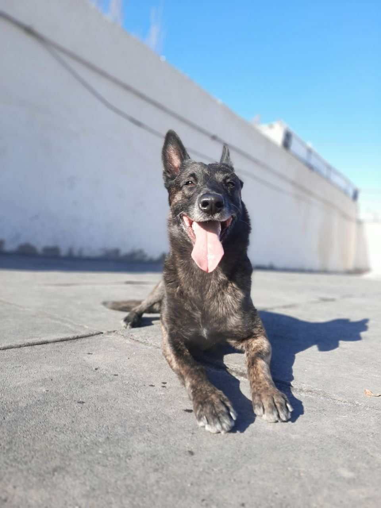

<!DOCTYPE html>
<html lang="fa">
<head>
    <meta charset="UTF-8" />
    <meta name="viewport" content="width=device-width, initial-scale=1" />
    <title>Atom Academy</title>
    
</head>
<body>
    

        
        <h1>ATOM ACADEMY</h1>
        
ANY DOG . ANY AGE . ANY PROBLEM

        
        <a href="https://chat.whatsapp.com/BaXzEgzGxdq6eHPJDyAYzm" class="button whatsapp" target="_blank">Join WhatsApp Group</a>
        <a href="https://t.me/+UdrKHSN9kFMzMDQ0" class="button telegram" target="_blank">Join Telegram Group</a>
        

            
📞 0915 566 6282

            
📷 <a href="https://instagram.com/Atom.academyy" target="_blank">@Atom.academyy</a>

        

    

</body>
</html>
